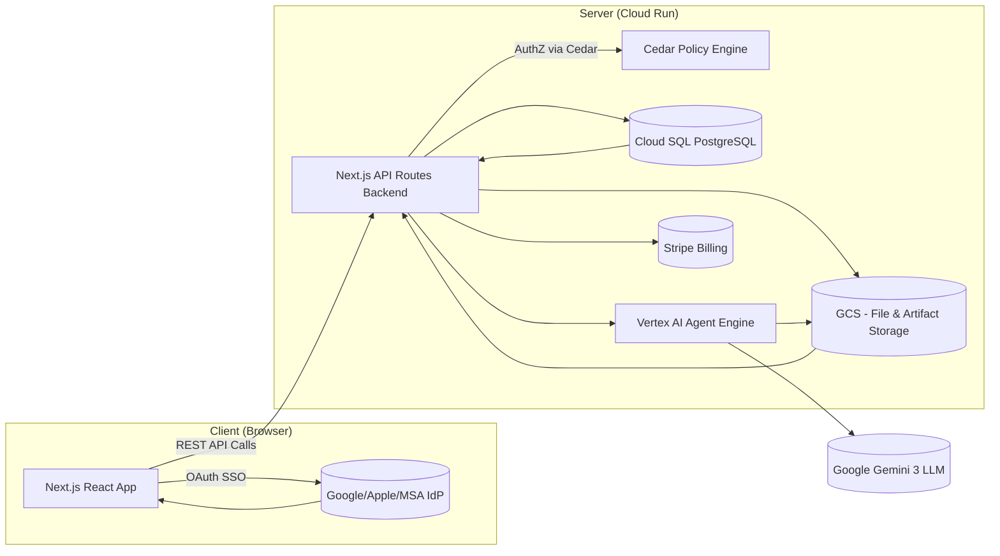

# AI Expert Agents Platform – Comprehensive MVP Design Document

## Introduction and Product Overview

The AI Expert Agents Platform is a consumer-facing web application that gives users access to a suite of specialized AI "expert" agents in various domains. The platform addresses the common problem where users query general Large Language Models (LLMs) but get mediocre answers due to lack of context or domain guidance. Our solution provides expert-guided context for queries: each expert agent is preloaded with specialized knowledge and context, leading to higher quality, context-aware responses. Users can interact with these agents through a rich web interface that supports text, images, and document inputs, and receive detailed responses (reports, analyses, etc.) as structured data rendered in Markdown format. The system is designed for both individual users and organizations (teams or enterprises), emphasizing security, scalability, and ease of use.

### Key Goals:

- **Easy Access to AI Experts:** Allow non-technical users to seamlessly interact with AI agents specialized in different fields (legal, finance, health, etc.) via a unified application.
- **Rich Context and Guidance:** Bridge the gap in LLM usage by providing relevant context up front. Users can upload documents (PDFs, images, text) and provide background info which the expert agent will incorporate into its responses. This context-driven approach aims to produce significantly better answers than vanilla LLM queries.
- **Interactive User Experience:** Provide intuitive UI tools for users to refine and explore results – e.g. highlighting portions of the AI's report to ask follow-up questions or add clarifications, engaging in Q&A chats with the agent, and iteratively improving the output.
- **Multi-Tenancy (Individuals, Teams, Enterprises):** Support personal accounts as well as organization accounts. Enterprises can onboard their domain (SSO integration, domain verification) and upload company-wide knowledge bases that all agents can use. Small teams can be created without enterprise SSO, using invite links and social logins, to share context and token quotas in a group.
- **Scalability and Serverless Design:** Architect the system to handle potentially hundreds of distinct expert agents and a large user base with minimal operational overhead. The solution should leverage serverless and managed services to scale automatically under load and scale down to near-zero cost when idle.
- **Security and Isolation:** Enforce strict tenant isolation so that data and context from one user or organization is never exposed to another. Use robust authorization policies (default deny) and sandboxing for AI agents to prevent any cross-user data leakage even in the event of prompt injection or compromised components.
- **Billing and Quotas:** Implement a flexible token-based usage model. Users (or orgs) subscribe to monthly plans that grant a certain token quota (LLM usage tokens) with optional rollover and top-up purchases for overages. The system will track usage per user/org and enforce limits, with Stripe used for payment processing.
- **Observability and Quality:** Incorporate thorough logging, tracing, and analytics. Every user interaction can be traced through the system (with OpenTelemetry) to help debug issues and analyze usage patterns. We will gather usage metrics (which agents are used most, token consumption, common user queries, etc.) to continually improve the product.

## System Architecture Overview

The platform follows a modern web architecture with a Next.js frontend and a serverless backend hosted on Google Cloud. High-level, the system consists of: a React/Next.js application for the user interface (including static landing pages for each expert), a set of Next.js API routes implementing backend logic (authentication, file uploads, agent query handling, etc.), integration with Google Cloud's Vertex AI Agent Engine to run the AI agents, and various supporting cloud services for storage, database, and monitoring. The design emphasizes modular components that communicate via well-defined APIs, as illustrated below.

_High-level system architecture, showing user interactions with the web app, backend services, and the Vertex AI Agent Engine._

In this architecture:

- **Client:** The frontend is a Next.js web app (React + Radix UI) running in the browser. Users access it via a web browser on desktop or mobile (responsive design). The client handles UI rendering, routing, and calls backend APIs (via Next.js API routes) for actions like logging in, uploading files, or querying an agent.
- **Identity Providers (SSO):** For authentication, the client interacts with external Identity Provider (IdP) services of Google, Apple, Microsoft Account (MSA) for social login (OAuth/OIDC flows). Enterprise users authenticate via SAML/OIDC with their corporate IdP (e.g. Okta, Azure AD) if their company is set up in the system. After SSO, a secure session is established for the user.
- **Backend API (Next.js API Routes):** The backend logic runs as serverless functions (Node.js) as part of the Next.js app deployment (e.g. on Cloud Run). These API endpoints handle all application operations: user and org management, authorization checks, agent session management, file processing, etc. Every API call enforces authorization via the Cedar policy engine (see Identity & Authorization below).
- **AI Agents (Vertex AI Agent Engine):** All AI expert agents are implemented on Google Cloud Vertex AI's Agent Engine . This managed service allows us to deploy and run complex agent workflows with minimal infrastructure overhead. The Agent Engine supports multi-step reasoning, tool use, and "chain-of-agents" orchestration, along with built-in session management and long-term memory capabilities . Each expert agent we provide is essentially an agent (or a chain of sub-agents) hosted in this environment. The backend API routes will call the Agent Engine's API to query a specific agent with the user's question and context. The Agent Engine takes care of executing the agent logic (using the latest Google Gemini LLM under the hood) and returns the agent's response.
- **Data Storage:** We use Google Cloud Storage (GCS) as a central object store for any large content: user-uploaded files (images, PDFs, etc.), stored conversation transcripts or summaries, and agent output artifacts (reports). Uploaded files are stored in GCS buckets with strong access controls (each file tagged by its owning user/org). When an agent needs to analyze a file (e.g. an image), the backend will generate a time-limited presigned URL to that file and include it in the agent's context prompt, allowing the agent to fetch the file during its execution. The agents themselves do not have broad access to GCS – they only see what is explicitly provided via these signed URLs, ensuring principle of least privilege. For structured data (like user profiles, org info, subscriptions, usage records, etc.), we will use **Cloud SQL for PostgreSQL**. This DB stores metadata and state (user accounts, org memberships, roles, token balances, conversation indices for each session, etc.).
- **Observability & Analytics:** The platform integrates with Google Cloud's monitoring stack. All backend services emit logs to Cloud Logging and traces to Cloud Trace (via OpenTelemetry). The Vertex AI Agent Engine itself has native support for tracing agent executions , which we will leverage to get insight into agent reasoning steps and performance. We will collect metrics such as number of queries per agent, token usage per user, latency, and error rates, feeding into dashboards for developers and for business analytics.
- **Third-Party Services:** The system integrates with Stripe for billing. A backend service (or Stripe webhook handler) manages subscriptions, processes payments for monthly renewals and any on-demand token purchases, and keeps the user's token quota in sync. We also integrate with email service (for sending team invites, system notifications) and possibly an analytics service for frontend clickstream (to analyze UI usage patterns).

Below is a component diagram illustrating these interactions:



_Explanation:_ A user interacts with the React UI in their browser. For example, they click "Login with Google," which directs them to the Google IdP, then back to our app with an OAuth token. The Next.js API backend completes the login, creates/updates the user record, and issues a session token. When the user asks a question to an expert agent, the browser calls our API (including the user's auth token). The API route first checks authorization via Cedar (ensuring the user has access to query that agent and sufficient quota, etc.), then it packages the query along with any user-provided context (uploaded files, text, org-specific knowledge) and calls the Vertex AI Agent Engine's API for the target agent. The Agent Engine (which runs our agent's logic on GCP) processes the request using the Gemini 3 LLM (the latest multimodal model, capable of handling text and images with a huge context window) and returns a **structured JSON response** conforming to the agent's Output Schema. Our API validates this JSON, renders it to Markdown, and forwards it to the frontend. All data accesses (reading/writing files, database records) go through our backend, which enforces multi-tenant isolation at every step.

## Core Components and Design Decisions

### Frontend (Next.js + React + Radix UI)

- **Framework:** We use Next.js (latest stable release) with React for building the web interface. Next.js gives us SSR/SSG for fast initial loads and an API Routes framework for backend logic. We favor Next's built-in capabilities to minimize custom server code.
- **UI Library:** We adopt Radix UI Primitives and a design system for accessible, polished UI components. This ensures consistency and reusability in UI elements (buttons, dialogs, dropdowns, etc.) while allowing custom styling to fit our brand. We will create reusable components for common patterns (file uploader, chat message bubble, comment threads, etc.) and avoid duplicating logic.
- **Responsive Design:** The UI will be responsive to support mobile web access (though our primary design target is desktop web for MVP). Using Flexbox/Grid and Radix primitives, we ensure the layout adapts to smaller screens. (A future native mobile app can use the same backend APIs thanks to an API-first design approach.)
- **State Management:** We follow industry modern standards: **TanStack Query (React Query)** or **SWR** for managing server state (caching, revalidation, loading states) to ensure a snappy, synchronized experience. For local UI state (modals, form inputs), we use React's built-in `useState` and `useContext`. Global client-only state is minimized to reduce complexity.
- **Frontend Routing:** Next.js will handle routing. We'll have pages for: Landing (home) and potentially separate landing pages per agent (more on this later), the main app interface (once logged in), and admin pages for org management, etc. Protected routes (like the main app) will require auth; Next can use middleware to redirect unauthenticated users to login.
- **API Integration:** The front-end communicates with backend via HTTP calls to our Next.js API routes. We use RESTful endpoints for MVP (e.g., `GET /api/agents`, `POST /api/query`, `POST /api/org/invite`, etc.). We ensure consistent error handling and loading states for good UX feedback.

### Identity & Access Management (AuthN & AuthZ)

#### User Authentication (AuthN)

We support multiple sign-in methods:

- **Social Logins:** Users can sign up or log in using Google or Apple accounts (which covers a majority of consumers). We integrate using OAuth 2.0/OpenID Connect – leveraging libraries or services that streamline this (e.g., NextAuth.js or Firebase Authentication with Google/Apple providers). After a successful OAuth callback, we create or update the user's account in our database (storing name, email, IdP UID, etc.).
- **SAML/OIDC Enterprise Auth:** We support **Bring Your Own (BYO) Identity**. Enterprise admins can configure their own Identity Provider (IdP) such as Okta, Azure AD, or PingIdentity via SAML 2.0 or OIDC. We will use an auth middleware (e.g., Auth.js/NextAuth or a specialized service) to handle the protocol complexity, allowing any compliant IdP to be connected.
- **Team Invites:** For "Team" organizations, we restrict invites to users with identities from our supported general providers: **Google, Apple, or Microsoft**. This ensures a verifiable identity backbone without managing custom passwords. When a user is invited via email, they must authenticate with one of these providers to accept.

#### Organization Models

We have two types of organizations in the system:

- **Enterprise Org:** An organization tied to a business domain. Enterprise orgs require domain verification and SSO config. To create one, a user (who becomes the Org Owner) specifies the company domain (e.g. example.com). Our system generates a random token that the user must add to a DNS TXT record for that domain to prove ownership. Once verified, the user can set up SSO (or if it's a Google Workspace domain, possibly we allow Google OAuth for any user @example.com). All users authenticating via that domain's SSO will automatically be associated with this org. Enterprise org members do not invite each other via email through our app; instead, anyone with a company email who logs in via the company SSO is recognized and added to the org.
- **Enterprise Context:** Enterprise admins can upload company-wide context documents (PDFs, knowledge bases, etc.) that become available to all expert agents for users in that org. They can also upload or specify context that applies to specific agents (for example, a finance company might upload financial policy documents only relevant to the "Finance Advisor" agent). This context is stored in our system (GCS or Cloud SQL with pgvector) and will be injected into agent prompts whenever a user of that org queries the relevant agent.
- **Team (Small Org):** A lighter-weight organization that anyone can create, intended for small businesses or groups that don't want the complexity of domain verification. A user can create a Team (becoming its Owner) and then invite others via email. Team members log in via the normal social login (Google/Apple/MSA), typically using whatever email was invited (we ensure the identity email matches the invite email to prevent confusion). Team orgs don't enforce a single domain or SSO for all members, aside from linking common domains to providers as described.
- **Team Context:** Similar to enterprise, a team can upload shared documents or context that apply to all team members' agents. The scope and mechanism are the same – the team admin can upload general context or agent-specific context files. This allows a small team to, for example, share a set of documents that their agents should use (perhaps a shared project knowledge base).

Both org types allow role-based administration and shared resources, with the key difference being how members join (SSO domain vs invites). Internally, we will likely have a single "Org" model with a flag for type = enterprise or team, and code paths to handle the join logic accordingly. This maximizes reuse and keeps permission handling consistent.

### User Roles and Authorization (AuthZ)

We will use **Cedar**, an open policy engine by AWS (open-source), for a unified fine-grained authorization checks. Cedar allows us to define roles and permissions via policies, enforcing a default deny model where nothing is allowed unless a policy explicitly grants it (principle of least privilege). We will integrate the Cedar policy engine as part of our backend (likely as an in-memory library or a microservice) and call it on every API request to ensure the request is authorized.

### Role Architecture (RoleID → Cedar Policy)

We define roles abstractly as **Role IDs** (e.g., `role:org_owner`, `role:team_member`). These IDs are not hardcoded with logic; instead, they map directly to **Cedar Policies** that define their capabilities. This ensures future extensibility—adding a generic "Auditor" role later is just adding a new Role ID and a corresponding Cedar policy file, without changing application code.

**MVP Role Definitions:**

- **Individual User:**
  - `role:user` (Default): Can manage own profile, billing, and private agent sessions.

- **Team Org (Self-Serve):**
  - `role:team_owner`: Full control over billing, invites, and shared context.
  - `role:team_admin`: Can manage members and shared context, but cannot modify billing/subscription.
  - `role:team_member`: Can use agents and view shared team context.

- **Enterprise Org:**
  - `role:org_owner`: Complete administrative control, including SSO config and domain verification.
  - `role:org_admin`: Managing users, context, and day-to-day operations.
  - `role:org_member`: Standard employee access to agents.
  - `role:org_auditor`: Read-only access to usage logs and conversation history (if enabled) for compliance.
  - `role:billing_manager`: Specialized role for managing invoices and payment methods only.

#### Authorization Policies

Cedar policies will enforce who can do what. Some examples:

- A Team Owner/Admin can invite new members to their team, upload or remove shared context docs for the team, and view usage/billing for the team. A Team Member can only use the agents and view content, not manage settings.
- Enterprise Admin can manage SSO settings, verify domain, upload org-wide context, and manage any user's sessions or content within that org. Enterprise Member simply uses the agents and their own content.
- Enterprise Admins **can** view individual conversations for compliance auditing, but this is an **opt-in** feature per enterprise configuration to respect privacy.
- Personal Users (no org) can obviously manage their own account, subscribe to a plan, and use agents, but have no organizational context to manage.
- Everyone, including anonymous users (not logged in), will have some scope of access defined: e.g., anonymous can only access the public landing pages, but cannot call the actual agent APIs without login. We will create an "anonymous" principal in Cedar with very limited permissions (essentially only to view public pages or initiate SSO flow).

Cedar's policy templating will help enforce resource-level permissions. For example, we can have policies like "permit(action=='QueryAgent') if principal is OrgMember of resource.org AND resource.agent is allowed for org", etc. By making everything resource-scoped (agents, files, conversations tagged by org or user), and default denying, we mitigate cross-tenant access by design. If no policy explicitly allows a user to access a resource, it's forbidden. We will also incorporate forbid policies for extra safety guardrails (e.g., if someone tries to access another org's resource, an explicit deny can override any misconfigured permit). Cedar's evaluation is fast and can be done in-memory; we will load/update policies as orgs and users are configured.

## AI Expert Agents (Architecture & Context Injection)

All expert agents are implemented using Vertex AI Agent Engine on Google Cloud, ensuring a scalable and secure runtime for the AI logic. Each agent is essentially a custom chain-of-thought or tool-using bot specialized in a domain, built with the help of Google's tools:

- We will define each agent's "persona" with a combination of prompt templates and contextual knowledge. For example, a "Legal Advisor" agent might have a base prompt like: "You are a legal expert AI specializing in contract law…" plus a set of reference documents (legal texts or guidelines) available to it. The Agent Engine allows us to deploy agents with such static context or with integrated knowledge bases. We can store these domain documents either in the Agent's Example Store (for few-shot examples or knowledge retrieval) or as part of a vector index that the agent can query.
- The Agent Engine supports multi-agent orchestration. If an expert agent's logic requires multiple steps or sub-agents (for instance, an agent might first do data extraction then analysis), we compose that. We leverage Google's **Agent2Agent (A2A)** protocol for agent interoperability. Since we define all agent inputs and outputs using **Zod schemas** (which export to JSON Schema), our agents are A2A-compatible by design. This enables structured data to flow seamlessly between agents—one agent's Output Schema can directly feed another's Input Schema.
- **Context Injection:** When a user asks a question to an agent, our backend gathers all relevant context to include in that query. This includes:
  - **User-provided context:** any text the user entered as background, any files they uploaded for this query. For text input, we prepend it to the prompt (e.g., "Context: [user's text]"). For files, as mentioned, we provide a presigned URL. For images, we provide the image directly (supported by Gemini).
  - **Org/Team context:** if the user is part of an org that has shared context relevant to this agent, we retrieve that (likely as text snippets or a vector store query result). We perform a relevance search to avoid dumping the entire company knowledge base. If context is large, we **will** integrate a basic retrieval-augmented generation (RAG) step – e.g., using an embedding model to match the user's query with documents and only injecting the top N relevant pieces.
  - **Agent's static context:** the agent's own knowledge or few-shot examples. The Vertex Agent Engine has an Example Store feature where we can keep example Q&A pairs or other reference data . We'll utilize that to store the agent's base guidance.
    - **Massive Static Knowledge (e.g. Law/Code Books):** For agents requiring access to massive internal datasets (like entire legal codes, medical journals, or technical manuals) that exceed standard prompt limits, we will index this data in **Vertex AI Search**. The agent will be configured with a tool/retriever to query this hosted RAG service to fetch only relevant sections on demand.
    - Some agents might use tools (e.g., a coding agent might use a code execution tool). Tools integration is also supported via the Agent Engine (with a secure sandbox for code execution , and the ability to call external APIs in a controlled way).

All this context is assembled in the prompt or via the Agent Engine's memory mechanisms, and the agent processes it. We will ensure that if an agent uses multiple steps or sub-agents, each receives the appropriate slice of context. For instance, if we have an agent chain like [ImageAnalyzer -> ReportGenerator], the image and related info goes to the ImageAnalyzer sub-agent, whose output (e.g. extracted text or description) then feeds into the ReportGenerator agent along with textual context. Our agent definitions will clearly map which context variables feed into which part of the chain.

### Adding New Agents Easily

To support rapid addition of many expert agents, we design the system so that agents are defined in a data-driven way rather than hard-coded. We will maintain an Agent Catalog (a configuration file or database table) that lists all agent definitions. Each entry includes metadata such as:

- **Agent ID/Name** (e.g. "finance_planner"),
- **Display name and description** (for UI and marketing),
- **Input Template Schema:** (See dedicated section below)
- **Output Template Schema:** (See dedicated section below)
- **Localization:** Support for localized variations (e.g., "Tax Advisor" -> "US", "UK", "Japan" variants) served via the same agent logic but different regulatory context files.
- **Prompt Template Location:** References to the system prompt which can interpolate the values provided in the Input Template (e.g., `{{target_audience}}`).
- **Specialized features** (image input, highlight/comment enabled, etc.),
- **Access control info** (public vs restricted),
- **Version or stage**.

#### Input Template Schema (Developer Framework)

To enable rapid and type-safe definition of agent inputs, we standardize on **Zod** as our schema definition language. Zod schemas are defined in TypeScript, providing full type inference, runtime validation, and easy transformation.

**Why Zod?**

- **Type Safety:** Schemas are TypeScript-native, giving developers autocomplete and compile-time checks.
- **Runtime Validation:** The same schema validates data at runtime in both frontend and backend.
- **Ecosystem:** Zod integrates with popular form libraries (e.g., `react-hook-form` via `@hookform/resolvers/zod`) for automatic form generation and validation.
- **JSON Schema Export:** Zod schemas can be exported to JSON Schema (via `zod-to-json-schema`) for use with other tooling if needed.

**Schema Structure:**

Each agent's input template is a Zod object defining:

1.  **Structured Fields:** Primitives like `z.string()`, `z.enum()`, `z.boolean()` with `.describe()` for UI labels/hints.
2.  **Single File Upload:** `z.instanceof(File)` for a single required file.
3.  **Multi-File Upload:** `z.array(z.instanceof(File))` for multiple files mapped to a single input name. The frontend renders a multi-file picker, and the backend processes all files under that key.
4.  **Conditional Logic:** Zod's `.refine()` and `.transform()` for complex validation rules.
5.  **Context Gathering Mode:** A top-level flag (`guidedInterview: boolean`) indicating if the agent should enter an interactive Q&A flow before main processing.

**Example (with Multi-File Upload):**

```typescript
// agents/legal-advisor/input-schema.ts
import { z } from "zod";

export const LegalAdvisorInputSchema = z.object({
  jurisdiction: z
    .enum(["US", "UK", "EU"])
    .describe("The legal jurisdiction for this analysis."),
  contractType: z
    .string()
    .min(1)
    .describe("Type of contract (e.g., NDA, Employment)."),
  // Single file upload
  primaryContract: z
    .instanceof(File)
    .describe("The main contract document to analyze (PDF)."),
  // Multi-file upload: user can upload multiple supporting documents
  supportingDocuments: z
    .array(z.instanceof(File))
    .optional()
    .describe("Additional supporting documents (amendments, exhibits, etc.)."),
  additionalContext: z.string().optional().describe("Any extra notes."),
});

export type LegalAdvisorInput = z.infer<typeof LegalAdvisorInputSchema>;
```

The frontend uses this schema with `react-hook-form` to dynamically render the input form. The backend validates the incoming payload against the same schema before processing.

**Mapping Inputs to Prompt Templates:**

After validation, the backend **interpolates** the input values into the agent's prompt template. We use a simple Handlebars-style placeholder syntax (`{{fieldName}}`).

1.  **Text/Enum Fields:** Directly substituted as strings.
    - Schema: `jurisdiction: z.enum(["US", "UK", "EU"])`
    - Prompt Template: `Analyze this contract under {{jurisdiction}} law.`
    - Result: `Analyze this contract under US law.`

2.  **Single File Upload:** The file is uploaded to GCS (or processed into RAG). A **reference** (e.g., a presigned URL or a file ID for the Find File tool) is injected.
    - Schema: `primaryContract: z.instanceof(File)`
    - Prompt Template: `The primary contract is available at: {{primaryContract.url}}`
    - Result: `The primary contract is available at: https://storage.googleapis.com/.../contract.pdf?token=...`

3.  **Multi-File Upload:** Each file in the array is processed. The prompt template receives a list of references.
    - Schema: `supportingDocuments: z.array(z.instanceof(File))`
    - Prompt Template:
      ```
      Supporting documents:
      {{#each supportingDocuments}}
      - {{this.filename}}: {{this.url}}
      {{/each}}
      ```
    - Result:
      ```
      Supporting documents:
      - amendment_v1.pdf: https://storage.googleapis.com/.../amendment_v1.pdf?token=...
      - exhibit_a.pdf: https://storage.googleapis.com/.../exhibit_a.pdf?token=...
      ```

**Backend Processing Flow:**

```
User Input (JSON + Files)
   |
   v
[Zod Validation] --> Reject if invalid
   |
   v
[File Processing]
   - Upload each file to GCS
   - (Optional) Index large files in Vertex AI Search / RAG
   - Generate presigned URLs or file IDs
   |
   v
[Prompt Interpolation]
   - Load agent's prompt template from catalog
   - Substitute {{placeholders}} with validated values and file references
   |
   v
[Call Vertex AI Agent Engine]
   - Send the fully-assembled prompt as user message
   - Agent returns structured JSON per Output Schema
```

#### Prompt Template Architecture (Agent Engine Integration)

The prompt template system bridges Zod schemas and the Vertex AI Agent Engine. Here's how it works:

**Template Engine Choice:** We use **Handlebars** (or a compatible subset like Mustache) for prompt interpolation. Handlebars provides:

- Simple placeholder syntax: `{{fieldName}}`
- Iteration: `{{#each items}}...{{/each}}`
- Conditionals: `{{#if condition}}...{{/if}}`
- Safe escaping by default

**Prompt Template Structure:**

Each agent has a prompt template file (e.g., `agents/legal-advisor/prompt.hbs`) with two sections:

```handlebars
{{! agents/legal-advisor/prompt.hbs }}

{{! SECTION 1: System Instruction (Agent Persona + Output Schema) }}
You are a legal expert AI specializing in
{{jurisdiction}}
contract law. Your task is to analyze contracts and provide actionable legal
insights. IMPORTANT: You MUST respond with a valid JSON object matching this
schema: { "executiveSummary": "string", "findings": [{ "title": "string",
"severity": "critical|high|medium|low", "description": "string",
"clauseReference": "string (optional)" }], "recommendations": [{ "action":
"string", "priority": "immediate|short-term|long-term", "rationale": "string"
}], "appendix": "string (optional)" } Do NOT include any text outside the JSON
object.

{{! SECTION 2: User Context (Dynamic per request) }}
## Contract to Analyze - **Type:**
{{contractType}}
- **Jurisdiction:**
{{jurisdiction}}
- **Primary Document:**
{{primaryContract.url}}

{{#if supportingDocuments.length}}
  ## Supporting Documents
  {{#each supportingDocuments}}
    -
    {{this.filename}}:
    {{this.url}}
  {{/each}}
{{/if}}

{{#if additionalContext}}
  ## Additional Instructions from User
  {{additionalContext}}
{{/if}}

Please analyze the contract and provide your findings.
```

**How This Maps to Agent Engine API Call:**

When calling Vertex AI Agent Engine via the ADK or REST API, we map the interpolated template to the appropriate fields:

```typescript
// Backend: Calling Agent Engine
import { AgentEngineClient } from "@google-cloud/agent-engine"; // Hypothetical SDK

async function queryAgent(agentId: string, validatedInput: LegalAdvisorInput) {
  // 1. Load prompt template from catalog
  const template = await loadPromptTemplate(agentId); // Returns Handlebars template

  // 2. Prepare context object (Zod-validated input + processed file refs)
  const context = {
    ...validatedInput,
    primaryContract: {
      filename: validatedInput.primaryContract.name,
      url: await uploadAndGetSignedUrl(validatedInput.primaryContract),
    },
    supportingDocuments: await Promise.all(
      (validatedInput.supportingDocuments || []).map(async (file) => ({
        filename: file.name,
        url: await uploadAndGetSignedUrl(file),
      })),
    ),
  };

  // 3. Interpolate template with context
  const assembledPrompt = Handlebars.compile(template)(context);

  // 4. Call Agent Engine
  const response = await agentEngineClient.query({
    agent: `projects/${PROJECT}/locations/${LOCATION}/agents/${agentId}`,
    sessionId: sessionId, // For multi-turn context
    userMessage: assembledPrompt,
    // Optional: Pass Output Schema for Gemini's structured output mode
    generationConfig: {
      responseMimeType: "application/json",
      responseSchema: zodToJsonSchema(LegalAdvisorOutputSchema),
    },
  });

  // 5. Validate and return
  const parsed = LegalAdvisorOutputSchema.parse(JSON.parse(response.text));
  return parsed;
}
```

**Key Design Decisions:**

| Aspect | Decision | Rationale |
| --- | --- | --- |
| **Where interpolation happens** | Our backend (not Agent Engine) | Full control, testability, no vendor lock-in |
| **Template engine** | Handlebars | Simple, widely used, supports iteration/conditionals |
| **Output constraint** | Gemini structured output mode + Zod validation | Double enforcement: generation-time + post-validation |
| **Session handling** | Vertex Agent Engine Sessions API | Built-in multi-turn context, memory management |
| **File handling** | Presigned URLs in prompt OR tool calls | URLs for simple cases; tools for large/RAG files |

**A2A Protocol Alignment:**

When exposing our agents to external A2A callers:

1.  The caller sends a JSON message conforming to our Input Schema (published as JSON Schema in our Agent Card).
2.  Our backend receives this, validates via Zod, interpolates into the prompt, and calls Agent Engine.
3.  The structured JSON output (per Output Schema) is returned to the caller.

From the external caller's perspective, they interact with a JSON→JSON interface. The prompt templating is an **internal implementation detail** hidden behind the A2A contract.

This ensures a clean separation: Zod defines _what_ inputs/outputs exist, the prompt template defines _how_ inputs are presented to the LLM, and the backend orchestrates the flow.

#### Output Schema (Zod + Structured JSON + Markdown Rendering)

To ensure consistency, type safety, and enable multi-agent chaining, we define **Output Schemas using Zod**. Instead of prompting the agent to output raw Markdown, we instruct it to output **structured JSON** conforming to the schema (using Gemini's JSON output mode). A separate rendering layer then transforms this JSON into Markdown for display.

**Why Zod for Output?**

- **Type Safety:** Output data is validated and typed, catching malformed responses.
- **Multi-Agent Chaining:** Structured output from Agent A can directly feed as input to Agent B if schemas are compatible.
- **A2A Protocol Alignment:** Zod exports to JSON Schema, making our agents compatible with Google's Agent2Agent (A2A) protocol.
- **Flexible Rendering:** The structured data can be rendered to Markdown, JSON API response, or any other format.
- **Consistency:** All agents producing similar outputs (e.g., "reports") share the same data structure.

**Example Output Schema:**

```typescript
// agents/legal-advisor/output-schema.ts
import { z } from "zod";

export const LegalAdvisorOutputSchema = z.object({
  executiveSummary: z
    .string()
    .describe("A 2-3 sentence overview of the key findings."),
  findings: z
    .array(
      z.object({
        title: z.string().describe("Short title of the finding."),
        severity: z.enum(["critical", "high", "medium", "low"]),
        description: z.string().describe("Detailed explanation with evidence."),
        clauseReference: z
          .string()
          .optional()
          .describe("Relevant contract clause."),
      }),
    )
    .describe("List of issues or observations found."),
  recommendations: z
    .array(
      z.object({
        action: z.string().describe("Recommended action."),
        priority: z.enum(["immediate", "short-term", "long-term"]),
        rationale: z.string().describe("Why this action is recommended."),
      }),
    )
    .describe("Actionable next steps."),
  appendix: z.string().optional().describe("Supporting data or references."),
});

export type LegalAdvisorOutput = z.infer<typeof LegalAdvisorOutputSchema>;
```

**Agent Prompt Integration (Structured Output Mode):**

The agent's system prompt instructs it to output JSON conforming to the schema:

```
You MUST respond with a valid JSON object matching this schema:
{
  "executiveSummary": "string",
  "findings": [{ "title": "string", "severity": "critical|high|medium|low", ... }],
  "recommendations": [{ "action": "string", "priority": "...", ... }],
  "appendix": "string (optional)"
}
Do NOT include any text outside the JSON object.
```

Gemini 3's structured output mode enforces this at generation time, ensuring valid JSON.

**Markdown Rendering Layer:**

A simple rendering function transforms the validated JSON into Markdown for the UI:

```typescript
// lib/renderers/legal-advisor-renderer.ts
import { LegalAdvisorOutput } from "../agents/legal-advisor/output-schema";

export function renderToMarkdown(output: LegalAdvisorOutput): string {
  let md = `## Executive Summary\n\n${output.executiveSummary}\n\n`;
  md += `## Findings\n\n`;
  output.findings.forEach((f, i) => {
    md += `### ${i + 1}. ${f.title} (${f.severity.toUpperCase()})\n\n`;
    md += `${f.description}\n\n`;
    if (f.clauseReference) md += `*Reference: ${f.clauseReference}*\n\n`;
  });
  md += `## Recommendations\n\n`;
  output.recommendations.forEach((r, i) => {
    md += `${i + 1}. **${r.action}** (${r.priority})\n   ${r.rationale}\n\n`;
  });
  if (output.appendix) md += `## Appendix\n\n${output.appendix}\n`;
  return md;
}
```

#### A2A Protocol Alignment and Multi-Agent Chaining

Google's **Agent2Agent (A2A)** protocol defines a standard for agents to interoperate via structured interfaces. By using Zod for both Input and Output schemas, our agents are **A2A-compatible by design**.

**How it works:**

1.  **Agent Interface Definition:** Each agent exports its Input Schema and Output Schema as JSON Schema (via `zod-to-json-schema`). This constitutes the agent's "A2A Agent Card."
2.  **Frontend → Agent:** The UI collects user input via a form rendered from the Input Schema. The validated data is sent to the backend, which calls the agent.
3.  **Agent → Agent (Chaining):** If Agent A's Output Schema is compatible with Agent B's Input Schema, chaining is automatic. The backend validates A's output, maps it to B's input, and invokes B.
4.  **Agent → UI:** The Output Schema JSON is validated, then rendered to Markdown (or JSON, or charts) for display.

**Example: Multi-Agent Pipeline (Contract Review → Risk Assessment):**

```
User Input (Zod: ContractReviewInputSchema)
   |
   v
[Legal Advisor Agent]
   |
   v
Output (Zod: LegalAdvisorOutputSchema) --> validated JSON
   |
   v
[Mapper: LegalAdvisorOutput -> RiskAssessmentInput] (if schemas differ)
   |
   v
[Risk Assessment Agent]
   |
   v
Output (Zod: RiskAssessmentOutputSchema) --> validated JSON
   |
   v
[Markdown Renderer] --> Final Report for UI
```

**Schema Compatibility for Chaining:**

- **Direct Compatibility:** If `AgentA.OutputSchema` === `AgentB.InputSchema`, no mapping needed.
- **Mapper Functions:** For partial overlaps, define explicit mapper functions:
  ```typescript
  function mapLegalToRisk(legal: LegalAdvisorOutput): RiskAssessmentInput {
    return {
      findingsToAssess: legal.findings.map((f) => ({
        issue: f.title,
        severity: f.severity,
        context: f.description,
      })),
    };
  }
  ```

**Benefits of this Unified Approach:**

| Aspect | Benefit |
| --- | --- |
| **Type Safety** | End-to-end: Form → Backend → Agent → Downstream Agent → UI |
| **A2A Compatibility** | Our agents can participate in external A2A orchestration |
| **Multi-Agent Chaining** | Structured output enables clean pipelines |
| **Flexible Rendering** | Same data → Markdown, JSON API, charts, etc. |
| **Validation** | Input and Output validated at every boundary |
| **Reusability** | Shared schemas/renderers across similar agents |

When developers create a new expert agent, they will:

1. **Define the Input Schema (Zod):** Create the `input-schema.ts` file defining required user inputs with types and descriptions.
2. **Define the Output Schema (Zod):** Create the `output-schema.ts` file defining the structured data the agent must return.
3. **Create the Markdown Renderer:** Implement a `renderToMarkdown()` function that transforms the Output Schema to displayable Markdown.
4. **Create the Agent Logic & Prompt:** Deploy the agent to Vertex AI Agent Engine. The system prompt must:
   - Reference the Input Schema placeholders.
   - Instruct the agent to output JSON conforming to the Output Schema.
   - Ensure the agent is configured to access uploaded files via RAG/file API.
   - **Large Context / Hosted RAG:** For customers with large pre-loading contexts, enable **Vertex AI Search** (allow-listed for high-tier customers).
5. **Define Chaining Mappers (if applicable):** If this agent's output feeds another agent, define the mapper function.
6. **Register in Catalog:** Add the agent's metadata, input/output schema references, renderer, and endpoint mapping to the Agent Catalog.
7. **Validation:** Use feature flags or ACL to test the agent with a subset of users.
8. **Release:** Flip the flag to release.

This data-driven approach allows us to easily assign different input and output schemas to agents without changing frontend code. The backend handles validation, prompt assembly, output parsing, rendering, and optional downstream chaining.

### LLM Model

All agents will use **Google's Gemini model (v3 or later)** as the core LLM. This is a requirement that ensures we have state-of-the-art performance. Gemini 3 is multimodal and optimized for complex reasoning tasks , which aligns with our need for expert-level answers. By using Vertex AI, we automatically get access to Gemini and any future upgraded models (ensuring our app stays cutting-edge with minimal changes).

We will configure each agent to use an appropriate variant of Gemini (e.g., Gemini 3 Flash for highest quality if needed, or perhaps Pro for longer context if needed). Given it offers up to a 1 million token context window , we can include quite large contexts (great for long documents or extensive org knowledge). We also benefit from built-in tools like function calling and the secure code execution environment for agents that need it .

## Conversation Sessions and Long-Term Memory

One of the platform's key features is maintaining conversation state with each user-agent session, including a long memory so that context persists across sessions (for a limited time). Key design points:

- **Session Scope (Continuous Learning):** We address the "chat reset" fatigue common in other tools by preserving context. When a user starts interacting with an expert agent, we create a session context (like a chat session). Within a session, the agent will remember past interactions – questions asked, answers given, and any clarifications. This allows follow-up questions and iterative refinement without losing context. The Vertex Agent Engine's Sessions service will be used to store the conversation turns and provide them back to the agent as needed. We also store the conversation in our database for our own record (e.g., for displaying history to the user or for our summarization later).
- **Memory Retention Policy:** By default, we set a retention of 14 days for active sessions. This means if a user comes back to the same conversation within 14 days, the context is still available. If they are idle longer than the retention period (no messages in that session for X days, default 14), we will consider that session "cold." To save costs and not pollute the active memory, we offload that session's data. Offloading entails:
  - Generating a summary of the conversation that captures the important points (so the essence can be reloaded later).
  - Saving that summary, plus possibly the full conversation transcript, to cold storage (GCS).
  - Deleting or archiving the session from the active memory store.

  If the user returns later and wants to resume, we can retrieve the summary from cold storage and preload it into a new session as context (so the agent can recall what was discussed). We display a notice like "This conversation was inactive for a while, so we've summarized it for you." They can then continue with the agent using that summary as prior context.

  For summarization, we use an automated pipeline: an LLM (typically Gemini 3 Flash for speed/cost) condenses the chat. Consistency is important, so we use a standardized summarization prompt. This is done asynchronously (e.g., a scheduled Cloud Scheduler job triggers for sessions older than 14 days). Summaries are stored per session, per user. The summarization process itself will adhere to the same security (only authorized to fetch that user's conversation).

- **Revision History:** For interactions where the agent produces a longer artifact (like a report), we track revisions over the course of the session. Each time the agent produces a new version of a report, we store both the **structured JSON** (per the Output Schema) and the **rendered Markdown** with a version number or timestamp. This allows the user to view differences between versions (we can diff the Markdown for display or the JSON for programmatic comparison) and ensures accountability for changes. The UI presents an option to toggle between revisions or view change highlights.
- **Export and Sharing:**

  **Export Rendering Strategy:** For MVP, we use **Markdown as the intermediate format** for all exports (PDF, DOCX):
  - **Flow:** Zod JSON → Markdown Renderer → Markdown → PDF/DOCX Converter (e.g., `md-to-pdf`, Puppeteer, or Pandoc).
  - **Why Markdown-Intermediate?**
    - **Consistency:** "What you see on screen is what you export." Users expect the PDF to match the web view.
    - **Simplicity:** We already need Markdown for UI display, so there's no extra renderer to maintain per agent.
    - **Mature Tooling:** Markdown → PDF libraries are fast and well-supported.
  - **Future Option (Direct Rendering):** Since we store the **raw structured JSON**, we can later add `renderToPDF(output)` functions that bypass Markdown for agents needing precise document control (e.g., legal contracts with exact pagination, branded executive reports with custom headers/footers). This is a Phase 2 enhancement if needed.

  **User Features:**
  - Users can download outputs as PDF or DOCX via an "Export" button.
  - Users can share outputs with others. If sharing with another platform user, we implement an "artifact" resource with its own ACL: the user marks a report as shared and adds specific users (by email or username). Those users see it in a "Shared with me" section. Cedar enforces access control.
  - For external sharing, we generate a secure, time-limited read-only link. For MVP, recipients must log in for security.

## Interactive User Experience Design

We aim for a best-in-class UX that makes advanced AI agent interactions feel intuitive. Below, we outline the main user flows and the UI features that enable a rich, guided experience:

### 1. Landing and Onboarding

- **General Landing:** Users may arrive at a general landing page or a specialized landing page via an ad. The home landing page introduces the product value (access to AI experts) in simple terms. It will have a prominent call-to-action to "Get Started – it's free" or "Login with Google/Apple" to encourage quick onboarding (reducing friction by relying on SSO). It may also showcase a few highlight examples of what the expert agents can do (e.g., "Our Legal AI can review contracts for risky clauses in seconds.").
- **Agent-Specific Landing Pages:** We will create dedicated landing pages for specific expert verticals, each accessible via unique URLs (and used in targeted advertising campaigns). For example, a page for the "Marketing Copywriter" agent might have a URL like `/agents/marketing-copywriter`. When a user clicks a Google Ad about AI marketing content, they land here and see content tailored to that interest. This page will display:
  - A description of what that agent does.
  - Several example Q&A or task outputs specific to that domain (pre-generated). For instance, it might show a sample prompt a user might ask and a sample excerpt of the agent's output, to demonstrate quality.
  - Possibly testimonials or stats (if available) to build trust.
  - A clear CTA to sign up or sign in to try it.
- **A/B Testing on Landing Pages:** We will implement an A/B testing mechanism to optimize these pages. This might involve rotating different sets of example questions/answers or different heading texts to see what yields better conversion. We can do this by preparing multiple variants of content for each page and either randomly assigning a variant per visitor or tying it to the ad campaign parameters. We will track conversion metrics (clicks on the CTA, sign-up completion) for each variant. For MVP, we use manually curated examples and simple randomization for testing.
- **Seamless Auth:** Once the user clicks "Try now", if not logged in, they'll be prompted to sign in via Google or Apple (or enterprise SSO if applicable). We want to keep this flow as seamless as possible: clicking the button either launches the OAuth flow or directs them to a sign-in page with those one-click options. After authentication, the user is dropped directly into the application, ideally already in context of the agent they chose. For example, if they came from the Marketing Copywriter page, after login they should see the UI with the Marketing Copywriter agent selected, perhaps greeting them or ready for input.

### 2. Selecting and Switching Context (Personal vs Org)

If a user is a member of one or more orgs (including team or enterprise), they will have multiple "workspaces" available. We will provide a simple way to switch context using a dropdown menu or a profile switcher. The options might be: Personal, Team ABC, Enterprise XYZ, etc. Selecting a context changes the scope of what the user sees and does:

- The set of shared context documents available to agents will change (e.g., if in the enterprise context, the agent automatically knows about the enterprise's shared knowledge base; in personal, it only has what the user personally uploaded).
- Token usage will count against that context's quota (enterprise or team quota vs personal quota).
- Any content created (like a report artifact) will belong to that context. For example, if in enterprise context and the user generates a report, by default it might be considered company data – visible to org auditors or shareable within the org. In personal context, it's private to the user.
- We will visually indicate the current context (perhaps the org name is shown in the UI header or color schemes could differ subtly) to avoid confusion.

For enterprise users, note that even their "Personal" space is within the enterprise's domain (since they logged in with company SSO, all usage is under the enterprise account). We **treat** "Personal" workspaces as their private projects that other coworkers can't see by default. Enterprise admins have audit rights over these where required for compliance. This is made clear in the user agreement (e.g., "Your company can audit content you create on this platform"). Teams do not have such an audit feature; personal under a team is truly personal unless explicitly shared.

### 3. Using an Expert Agent – Chat Interface and Tools

Once logged in (and context selected), the user is presented with the main application interface. The layout may consist of: a sidebar to pick or switch the expert agent, and a main panel for the interaction with the agent. Key elements and interactions:

- **Agent Selection:** The user can choose a specific expert agent from a list (with search or categories if the list is long). Each agent might have an icon or avatar and a short label (e.g., "Legal Advisor", "Fitness Coach", etc.). If the user came via a landing page, that agent is pre-selected. We also have an option like "Ask OmniAI" which is the single entry point that will route the question to the best agent. If that is selected, the user just has one input box and the system will auto-choose an agent (explained below).
- **Context Input (Dynamic Forms & Guided Interview):**
  - **Input Template:** Instead of a generic text box, the UI renders a dynamic form based on the agent's **Input Template Schema** (using `react-jsonschema-form`). This ensures the agent gets the specific structured data it needs (e.g., "Target Audience" dropdown, specific file uploads).
  - **Guided Workflow:** Users can opt for an "Interview Mode" where the agent actively asks clarifying questions to build context before starting the task, preventing "empty context" poor results.
  - **Standard Inputs:** A general "Additional Instructions" text area and generic file attachment button remain available for ad-hoc context.
  - **Multimedia Support:** We show icons indicating supported types (text, PDF, image) to encourage multimodal input. When files are added (either via schema field or generic upload), we display previews.
- **Submitting Query:** The user hits "Go" or presses Enter. The query along with attachments is sent to the backend. We show a loading indicator or typing animation as the agent processes. Since calls to LLMs can take a few seconds, the UI should reassure the user that work is in progress.
- **Agent Response (Report):** The agent returns a **structured JSON response** conforming to its Output Schema. The backend validates this JSON using Zod, then renders it to Markdown using the agent's registered renderer. The UI displays this Markdown with proper formatting (using a secure Markdown renderer that escapes any unsafe HTML to prevent XSS). This could be a multi-paragraph report with headings, lists, etc. If the output contains references (like footnotes or citations), they are presented cleanly. The UI should feel like reading a document or an email from an expert.
- **Interactive Tools (Highlight & Comment):** One powerful feature is the ability for the user to give specific feedback or ask questions about the answer. Instead of only a linear chat, the user can directly select a portion of the agent's answer (e.g., a particular statement or bullet) and add a comment or question attached to it. For example, if the agent (a financial advisor) produced a budget plan and the user is unsure about one recommendation, they can highlight it and ask "Can you consider that I have this constraint instead…?" or "Why did you allocate this much to X?".
  - **Implementation:** The answer can be rendered in a component that supports text selection. Upon selection, a small tooltip "Comment" appears. Clicking it opens a comment input box (perhaps as a sidebar or overlay). The user types their question or note and submits. This comment is associated with that snippet of text (we might internally store it as an annotation with the text's reference or an index range in the content). The agent will then receive this specific feedback. Under the hood, when the user submits an inline comment, we formulate a new query to the agent – essentially a follow-up question that includes context about what part of the report it refers to. For instance: "User comment: [selected text]. User asks: [their question]. Please update your report accordingly." Because we have the full conversation state, the agent knows what it last answered. It can then incorporate the feedback and generate a revised answer.
  - The UI will update to show a new version of the report (either replacing the old one or in a versioned view). We can highlight changes or list the comments and resolutions. This inline commenting system allows a more natural document review process, similar to how one would collaborate with a human expert on a document.
- **Chat Q&A Mode:** In addition to inline comments, we will support a general chat sidebar for free-form Q&A with the agent. Think of it as a chat thread alongside the main report. Users can ask any number of clarifying questions or additional requests ("Can you also provide sources for that claim?" or "Explain this in simpler terms") in the chat, and the agent will respond in the chat. Upon the user's request, these Q&A exchanges can be applied to the report. For example, after a series of Q&A, the user might click "Update Report with these details" which triggers the agent to produce a new report version that incorporates everything discussed in the chat. This two-panel approach (document view + chat) provides a flexible workspace:
  - The Document panel (main) for the structured output and its revisions.
  - The Chat panel (side or bottom) for unstructured interaction. This design keeps the polished report separate from the messy back-and-forth, but still linked. It's a common UX pattern in AI writing assistants: having a draft and a chat assistant concurrently.
- **Tool Extensions (Agent-specific):** Some agents might have unique interactive widgets. For instance, an "AI Data Analyst" agent could present a graph based on data it analyzed, and allow the user to tweak parameters via a small form or slider. Or a "Code Assistant" agent might allow executing code and showing output right in the UI. Our design will accommodate plugin-like extensions. We can build these as modular components that can be turned on for specific agents. The agent catalog can specify if a special UI module is needed. For MVP, we might not implement a full plugin system, but we will design the frontend to easily show additional sections when an agent returns certain structured data. For example, if an agent returns a JSON with a key "chart: base64image", the frontend could render that image below the text answer. We will at least foresee this possibility so that adding such features later is smooth.

### 4. Single Entry-Point Agent (OmniAgent Orchestrator)

For users who don't know which expert to choose or prefer a one-stop approach, we have the "OmniAgent" entry point. This is a dispatcher and cross-domain orchestration layer: the user asks any question, and the system routes it to the most appropriate expert agent available:

- **Implementation-wise:** this uses a lightweight classifier model or a prompt to a general model to analyze the question ("This sounds like a legal question vs a medical question", etc.).
- **For MVP:** we use a straightforward approach: attempt to classify by keywords; if uncertain or multiple agents could handle, either choose one by priority or ask the user to confirm ("It looks like your question might be financial. Use the Financial Planner agent?").
- **Fallback:** If no suitable agent exists for the query domain, the system will respond politely that we currently have no expert in that area. We'll use this opportunity to collect feedback: e.g. "Sorry, we don't have an AI expert for that topic yet. Would you like to suggest we add one? [Yes button]". Clicking yes can log the request (and perhaps inform our roadmap). Transparency is important – we won't route to a random agent that isn't a good fit; we'll honestly indicate the gap, so user trust is maintained.

### 5. End of Session and Outputs

After the user is satisfied (or they can end the session anytime), they may want to save or share the results:

- **Saving:** All sessions and their outputs are automatically saved in the system (to DB and GCS). The user can access past sessions via a history interface (maybe a list of recent sessions by agent or date). They can favorite or pin certain results for quick access.
- **Export:** As mentioned, exporting to PDF/Doc is a feature. We'll implement a "Export" button that generates these on the fly (likely server-side rendering of Markdown to PDF using a library, or even by headless Chromium for full fidelity).
- **Sharing:** The user can choose to share with others. If they are in an org/team, they might share with colleagues. We'll provide an option like "Share to [Org/Team]" which essentially changes the artifact's ACL to allow all members of that org to read it (or we create a copy in a shared repository). They could also enter specific emails (within or outside org). If outside, we might invite that person to sign up to view. This ensures data isn't leaked publicly unless explicitly intended (we could allow generating a public link with a big warning – up to product decision).

### 6. Browser Extension Companion

To better integrate into business workflows, we will offer a browser extension. This allows users to:

- Select text on any webpage.
- Right-click to "Analyze with Expert Agent".
- Choose an agent (e.g., "Legal Advisor" for a contract on screen).
- The selected content is sent as context to a new or existing session, allowing seamless research without context switching.

Throughout the UX, we apply best practices:

- **Keep the interface uncluttered** even though it offers powerful features. For example, show advanced options (like sharing, exporting, or advanced agent settings) in secondary menus or modals, not in the primary flow. The primary view should focus on the conversation and content.
- **Provide guidance and tooltips.** On first use, a brief guided tour could highlight "Here's how to attach a file" or "Tip: try highlighting text in the answer to ask a follow-up." Such onboarding helps users discover features.
- **Ensure consistent design language and accessibility** (use proper ARIA labels, keyboard navigation support, high-contrast mode if needed).
- **Performance:** Use skeleton loaders and spinners appropriately so the user never stares at a frozen screen. If an agent's response is very large or slow, consider streaming partial results (Vertex AI supports streaming tokens, which we can forward to the UI to show the answer typing out). Streaming improves perceived performance. We will utilize streaming via the Agent Engine when feasible for a smoother experience.

## Multi-Tenancy and Security Isolation

Security is paramount in our design. The system is built to prevent any cross-tenant data access and to protect user data even in adversarial scenarios (like prompt injections or compromised components). Key strategies and practices include:

- **Strict Authorization on Every Request:** As noted, every API call requires an auth token and goes through Cedar policy enforcement. There are no "public" endpoints that return user-specific data without auth. Even endpoints that serve ostensibly public info (like a landing page example) will have an authorization context (either as anonymous or as a user) to ensure consistent handling. Cedar's default-deny stance means if something isn't explicitly allowed by policy, it won't happen . This eliminates misconfigurations like forgetting an access check on some new API.
- **Data Partitioning:** All data in the database is tied to an owner (user or org). For example, an uploaded file will have an owner_type (user/team/org) and owner_id. Queries for files will always include a filter on owner matching the current context. We will likely implement tenant-scoped database access functions to enforce this at the code level too (so developers can't even accidentally fetch data outside the user's scope). Similarly, GCS objects can be structured in buckets or prefixes per tenant (like bucket/org-<orgId>/... and bucket/user-<userId>/...) and even at the cloud IAM level, we could isolate access (though since our backend service is the one accessing GCS, we handle it in-app).
- **Sandboxed Agent Execution:** The AI agents themselves run on Vertex AI, which has strong isolation. The Agent Engine provides secure execution sandboxes for any tool usage or code the agent runs , and it supports VPC Service Controls to restrict the agent's network access . We will deploy our agents in a locked-down configuration: they should not have unrestricted internet access unless needed. For example, if an agent needs to call a public API as part of its function (rare in MVP), we'd explicitly allow that via approved tools. Otherwise, agents cannot make arbitrary external requests that could exfiltrate data. They operate within our cloud perimeter.
- **No Cross-Session Data Leakage:** Agents do have memory, but the Vertex Sessions feature isolates sessions per user (or per conversation). We will not use any global shared memory across users unless it's the intended org-shared context which is static. So there's no chance that Agent A answering User X will accidentally pull in content from User Y's session. The memory bank, if used, would be keyed by session or user, and Vertex AI's design supports storing/retrieving by key in a controlled manner . We will enforce that any retrieval of memory or examples is filtered by the active user/org context (through design, likely by separate memory instances or keys per org).
- **Prompt Injection Mitigations:** One threat is a user input that tries to manipulate the agent into revealing someone else's data (prompt injection). Because our agents only know what we give them, the main vector would be if a malicious user somehow got the agent to ask the system for unauthorized info. But since the agent cannot call any internal API without a tool and it has no credentials to fetch arbitrary data, this risk is minimized. We also control the prompts so that the agent is instructed to only use provided context and not deviate. We **incorporate** content filtering on user inputs to strip obviously malicious patterns, and similarly have the agent's output go through an AI safety filter (to avoid disallowed content). Vertex AI has content moderation options which we enable for the outputs.
- **Compliance Guardrails:** Validation layers that flag user inputs or agent outputs against configurable policy rules (e.g., PII detection, regulatory compliance checks).
- **Network Security and Deployment:** We will deploy the backend in a way that prevents non-authenticated access. For instance, if using Cloud Run, ensure environment variables (like DB credentials, API keys) are protected. If using GCP Cloud Run, we can integrate with Identity-Aware Proxy or other measures for internal endpoints. Our data stores and buckets should be in a private network or at least not world-accessible (except via our app). We'll use HTTPS everywhere for data in transit, and GCP's encryption at rest for data stores. We use Customer-Managed Encryption Keys (CMEK) for GCS where enterprise contracts require it.
- **Cross-Origin and XSS:** The web app is single-origin. We set a strict Content Security Policy (CSP) to mitigate XSS, disallowing inline scripts and only allowing resources from our domain and trusted CDNs. Since agent outputs are **structured JSON rendered to Markdown** by our controlled renderer, we avoid raw HTML injection. The Markdown renderer sanitizes any embedded HTML tags or scripts. This prevents any chance of an agent output including a malicious script that could affect the user's browser.
- **Audit Logging:** Security also means being able to investigate. We will log admin actions (like invites sent, domain verified, context files uploaded) with who did them and when. These logs can be surfaced to enterprise admins (Enterprise Audit) and also kept internally for forensic purposes. Google Cloud's Access Transparency logs could be leveraged if needed (though those are more about Google's access; not likely needed for our MVP). Our own audit logs ensure that if something weird happens, we can trace it.

In summary, the design adheres to Zero Trust principles: authenticate everyone, authorize everything (default deny), and minimize each component's access to only what is necessary (e.g., agents get presigned URLs instead of broad storage rights). This high-assurance approach means even in worst-case scenarios, an attacker or rogue agent would have extremely limited scope.

## Scalability and Performance

To handle potentially large scale (many users and many distinct agents), while also minimizing costs when idle, we leverage serverless and multi-tenant efficiencies:

- **Serverless Backend:** The Next.js app can be hosted on Cloud Run. In either case, it will scale out automatically based on incoming requests. When no traffic, it scales down to zero (Cloud Run can scale to zero). This meets our goal of nearly $0 cost when no active users. Cold starts might add a bit of latency, but for MVP that trade-off is fine given the cost benefit. We will optimize cold start by keeping the bundle lean and perhaps using provisioned concurrency if needed for steady load.
- **Vertex AI Agent Engine:** This is a fully managed service that scales our AI agent execution. We don't manage servers for the agents; Google handles scaling the underlying model inference and agent runtime. According to documentation, Agent Engine can scale to many concurrent sessions and uses the power of the cloud to handle spikes . It also presumably charges only per usage (and possibly has its own free tier ), meaning if no one is querying agents, costs are minimal. We will monitor usage to configure the right model instances (maybe the engine can auto-scale capacity or queue requests if needed).
- **Many Agents Efficiency:** We have 100+ expert agents, but they largely share the same underlying infrastructure (all running on Vertex, possibly even on the same model endpoint). This avoids having to duplicate backend processes per agent. The differences between agents are mostly in prompts and context, which are lightweight. Our backend catalog approach means adding an agent doesn't add runtime overhead except some metadata lookup. The agent logic itself is maintained by Google's infrastructure. So we can grow the catalog without worrying about maintaining a bunch of separate services.
- **Caching and Reuse:** We will consider caching certain things to improve performance:
  - If some org context documents are very large and frequently used, we might pre-embed them and store vectors for retrieval rather than injecting full text every time. This way an agent can just be given an index reference and fetch relevant parts from a vector store. This could be an optimization later; for MVP, if context sizes are moderate, we may skip this complexity.
  - Responses themselves could be cached if the same question is asked repeatedly by the same user (or possibly across users if context is identical and it's not private info). However, due to varying contexts, caching at the agent query level is tricky. More feasible is caching the landing page example responses – those we definitely precompute (or compute once) and store, to avoid querying the model for every page load.
- **Token/Budget Enforcement:** To ensure no single user over-consumes resources, we enforce the token quotas. The backend will estimate tokens for a request (based on input size and model response limits) and ensure the user/org has enough remaining. If not, it will either block the request or prompt an upsell ("You've run out of tokens, please purchase more or upgrade plan"). This not only ties to billing but prevents accidental runaway usage (which could impact costs/performance). The agent engine likely also has its own usage quotas, so aligning with those (and implementing backpressure or user-level rate limiting) might be necessary to avoid abuse.
- **Bulkhead and Limits:** We should set reasonable limits on input sizes for files (maybe no larger than X MB for analysis at once) to avoid overloading the system or extremely long model context. If a user uploads a 500-page PDF, we might warn or require them to use a smaller document (or process it differently). These limits ensure the system remains responsive.
- **Testing for Scale:** We will simulate load and see how the serverless backend behaves, ensuring it can scale up. Also test concurrent agent requests – since they rely on external API (Vertex), which can handle many, but we should handle their responses asynchronously. The Next.js API could use async calls so it doesn't block threads while waiting for the model, allowing parallel requests.

## Billing and Subscription Management

Our monetization is via subscription tiers with token quotas, with support for free tier and paid overages. The design:

- **Plan Definitions:** We will have a set of plans (likely stored in Stripe as Products and Pricing tiers, and mirrored in our DB for easy reference). For example: Free Tier – X tokens per month free; Basic – Y tokens/month for $; Pro – Z tokens; Enterprise/Team – custom or higher quotas. The design should allow arbitrary tiers, meaning product managers can add or modify plans without code changes (just via config/Stripe). We also allow special promotional periods – e.g., first month free or extra tokens for first 3 months, etc. Stripe can handle coupon codes or trial periods which we can integrate. We will keep track of any promotional logic in our DB as well (like an expiration date for a promo).
- **Token Quota Tracking:** Each user or org has a token balance that resets monthly (on their billing cycle date). We will track tokens consumed per request. Likely, we'll parse the model API response to get usage (the Vertex API will return how many tokens were input and output). We deduct that from the user's quota. If their quota runs out, further requests will be denied or diverted to the top-up flow. Rollover: Some plans allow unused tokens to carry over to the next month up to a cap (say up to 2x monthly quota). If so, at the reset time, we calculate the carryover (min(cap, unused)) and add it to next cycle's tokens. We'll implement this in our billing renewal logic.
- **Top-Up (Ad-hoc tokens):** If the user/org enabled pay-as-you-go overages, we handle it as follows: The user provides a payment method via Stripe and sets a max budget for extra tokens per month (e.g., "yes, allow up to \$50 of extra usage"). When their included tokens are exhausted, the system will automatically charge them for an extra bundle of tokens (the bundle size and cost defined by plan, e.g., 1,000 tokens for $5) and add those tokens to their balance. If they hit the max budget, we stop further charges and usage until next month or manual intervention. Technically, this can be done by creating a Stripe metered usage or on-demand invoice item. Simpler: we could treat it as they purchase a one-time pack (the backend triggers a Stripe charge and upon success credits the tokens). We will have an API or button "Purchase extra tokens" as well for those who want to manually top up instead of auto.
- **Stripe Integration:** We'll use Stripe Checkout or the customer portal for subscription management. The user can enter credit card details securely via Stripe's UI. We get webhooks for successful payments, failed payments, subscription renewals, etc. Our backend will listen to these webhooks:
  - On successful payment or renewal, update the user's plan status and token balances.
  - On charge fail, mark account as past due; possibly downgrade or restrict usage if not resolved.
  - On subscription cancel (user or failed payment after grace period), maybe move them to free tier.
- **Enterprise/Team Billing:** For enterprise orgs, usually one admin (Org Owner or Billing Manager) will handle the subscription for all members. They subscribe to an enterprise plan which provides a pool of tokens shared by all members. We track usage per member internally mainly for insights, but enforcement is on the org aggregate. The system should allow multiple members to consume tokens concurrently. The org's token pool resets monthly just like individual plans. Overages can similarly be enabled for org (the company card is charged). Possibly we allow both individuals and teams in an org to have their own plans? But likely simpler: if you are in an enterprise org, usage is on the enterprise's plan by default. (We might allow a personal plan concurrently, but the UI will mainly use the active context's plan).
- **Free Tier Consideration:** We likely will provide a free tier or free trial. Free tier might be something like 100 tokens/month with no card required, just to let users try basic features. This will attract signups. To prevent abuse, we can require email verification (which we inherently have via SSO for Google/Apple) and possibly some throttling. We will also have to be mindful of not allowing the free tier to be exploited by automated scripts – we might place a relatively low cap and maybe have some basic abuse detection (e.g., if one IP making tons of free accounts – but that's an edge case).
- **Usage Dashboard:** Users should be able to see their current token usage and quota status. We'll have a small dashboard or even just an indicator (like "You have used 300/5000 tokens this month"). Org admins will have a view of total org usage and maybe top users or agents consumed. This transparency helps users understand value and possibly upsell if they run low often.

## Observability and Analytics

To deliver a reliable service and continuously improve it, we build extensive observability:

- **Logging:** All key events and errors are logged using structured logging. We use Google Cloud Logging via Winston or a similar logger in Node. Sensitive data (like user prompts or agent outputs) we log carefully – perhaps store them in a secured section or redact PII if logging. But for debugging and improvement, having conversation logs (with user consent in terms) is valuable. We can sample logs of conversations to see where agents perform poorly, etc. We ensure logs are tagged with context like `requestId`, `userId`, `orgId` so they can be correlated.
- **Distributed Tracing:** We instrument the backend with OpenTelemetry. Each incoming API request generates a trace that follows the flow: from the Next.js API route through any internal calls (DB queries, calls to Vertex AI, calls to Stripe, etc.). Google Cloud Trace will store these. We configure sampling such that in dev and maybe beta, we sample 100% of traces for maximum visibility . In production, we sample at a lower rate (perhaps 1% or adjust dynamically) to control costs, especially if QPS grows high. However, we always sample error traces (if an error occurs, that trace is kept). These traces help us pinpoint slow spots (e.g., if the Vertex API call is the bottleneck or maybe our DB is slow, etc.), and see how a user interaction triggers a cascade of operations.
- **Metrics:** We will capture custom metrics like:
  - Number of queries per agent per time period,
  - Token usage per agent/user,
  - Response latency distribution,
  - File upload sizes, etc. Using Cloud Monitoring (Stackdriver) or even pushing events to a system like BigQuery for analysis. For example, we might log an event `agent_answer` with properties (`agentId`, `userOrg`, `tokensUsed`, `timeTaken`). This can feed dashboards and also be used for billing audits.
- **Clickstream & UX Analytics:** On the frontend, we integrate an analytics tool (could be something privacy-conscious like PostHog, or just Google Analytics) to track user behavior: page views, drop-off points, feature usage (like did they use the highlight feature? did they open the chat panel?). This data guides UI improvements. We ensure to respect privacy (maybe aggregate and don't collect sensitive text).
- **Alerting:** Set up alerts for key issues: e.g., high error rate on any API, or if token usage spikes abnormally (indicating possible abuse or bug), or if external integration like Stripe webhooks fail. PagerDuty or Cloud Alerts can notify the dev team promptly.
- **Session Traceability:** We implement correlation IDs so that we can trace an entire user session. For instance, generate a UUID when a user loads the app and include it in all subsequent requests from that session (store in a cookie or in-memory). This way, if a user reports a problem, we can search logs for that session ID and see the full sequence of events (clicks, queries, etc.).

All these telemetry efforts align with Vertex AI's built-in observability, which also allows tracing agent behavior internally (with tools to debug prompt chains if needed) . We'll make use of those to refine agent prompts and see where an agent might be failing. This holistic view of system performance and usage is critical for rapid iteration, given user feedback and system complexity.

## Environments, CI/CD, and DevOps

We adopt strong DevOps practices to manage the complexity of deploying this platform:

- **Multiple Environments:** We will have isolated environments for different stages:
  - **Dev (`expert-ai-dev`):** used for development and internal testing. This connects to a dev database, perhaps uses lower-cost models (if available) or lower quotas. It's updated frequently (continuous deployment from the dev branch). Developers and maybe a small internal team use this environment.
  - **Beta (`expert-ai-beta`):** a staging environment that mirrors production. This is for QA and for selected beta users or customers to test new features or agents early. It uses nearly the same config as prod (maybe smaller scale settings). Deployment to beta is done via a controlled promotion (e.g., when we tag a version as beta).
  - **Gamma (`expert-ai-gamma`):** possibly an intermediate pre-prod or load test environment. (The term "gamma" suggests maybe a limited release environment). We might use gamma as a short-lived environment for final verification or internal demos. Or it could be for a small external audience under NDA. This is optional; it depends on how the team wants to manage final QA.
  - **Prod (`expert-ai-prod`):** the live production environment for all users. Strictly controlled releases.
  - **Root Project (`expert-ai-root`):** a GCP project for shared infrastructure. This could host common resources like a container registry for images, perhaps the Pulumi state storage, or CI service accounts. It might also host global services that are not environment-specific (though ideally, each environment has its own isolated resources). The mention of root suggests maybe things like a central secrets manager or a monitoring project might reside there.
- **CI/CD Pipeline:** We will use a CI/CD system (perhaps GitHub Actions, GitLab CI, or Cloud Build) that automates build, test, and deployment. The workflow:
  - Every commit to dev branch triggers CI to run unit tests, linting, etc. If tests pass, it auto-deploys to the Dev environment (Continuous Deployment for dev). Developers can then see their changes live in dev.
  - When we're ready to promote to Beta, we create a Git tag in the format `beta-YYYYMMDDHHmmss` (timestamped). The CI pipeline detects this tag and if it matches the pattern for beta, it takes the corresponding commit and deploys that to the Beta environment. Similarly, a tag `prod-YYYYMMDDHHmmss` would trigger deployment to Prod (after perhaps an approval step if we want human gate). This tagging strategy ensures traceability of exactly what code went out.
  - **Automated tests** will also run on these environments. We will maintain suites of:
    - Unit tests for logic (run on every commit).
    - Integration tests that might run against a deployed dev environment (e.g., test an API endpoint end-to-end with a dummy agent).
    - End-to-End (E2E) tests using a browser automation tool like Playwright. Playwright tests can simulate a user clicking through the UI, logging in (we might stub the SSO in test or use a test account), asking a query, and verifying the UI responds. We will run these E2E tests on the staging (beta) environment for each release candidate tag. Only if they pass do we proceed to prod deployment.
  - Load tests maybe in Gamma environment to ensure performance.
- **Pulumi Infrastructure as Code:** All cloud resources (GCS buckets, databases, service accounts, IAM roles, etc.) are defined in code (using Pulumi in a preferred language, e.g. Python (1st choice) or TypeScript). This code is part of the repository and gets applied via CI as well. The first time setup of each environment's infra can be done by running Pulumi targeting that environment's config. Thereafter, changes to infra (like adding a new bucket or increasing a quota) are made by editing code and running through CI – no manual clicking in cloud console to create resources. This ensures consistency (e.g., dev and prod infra are similar except where scaled differences are configured), and changes are tracked in version control.
- **No manual hotfixes:** We avoid manual changes in prod; even urgent fixes go through the CI with proper testing (perhaps a quick tag). This discipline prevents config drift and errors.
- **Beta Feature Rollout (Agent Allow-listing):** We incorporate mechanisms to release features to only certain users or orgs. For new agent types, we will use an allow-list. Concretely, in the agent catalog config, an agent can have an `allowed_orgs` or `allowed_users` list. The UI will hide the agent for others, and the backend will also enforce calls to that agent are rejected if not allowed (authorization can check user's org against that list, possibly via Cedar policy like requiring a "beta tester" attribute). This allows us to invite e.g. a couple of design partner customers to try a new agent. In practice, to an allowed user the agent appears in the catalog (maybe with a "Beta" label). Others won't see it in the list. If an unallowed user somehow guesses the ID, the backend will deny access.
- Additionally, feature flags could be used for other UI features toggles. But for MVP, agent access is the main gated feature.
- **Telemetry in CI/CD:** We will integrate tests and code analysis in the pipeline. For example, run static analysis (linters, maybe security scanners for known vulns). Ensure code formatting (Prettier/ESLint for JS, etc.) to maintain code quality.
- **OpenTelemetry in Lower Env:** In dev, we set trace sampling to 100% to capture every detail. This helps developers debug issues by inspecting traces in Cloud Trace. We won't sample down in dev since QPS is low. In prod, sampling as mentioned for performance.
- **Resource Management and Cost:** We use monitoring to ensure our usage of Vertex AI and other resources is within budget. If needed, set budget alerts on GCP. The serverless nature should handle scaling economically, but the LLM usage can be costly – hence the importance of token limits and possibly caching common queries or using lower tiers for non-critical tasks.
- **Pre-commit Hooks:** Developers will have pre-commit hooks (using Husky or similar) to run basic checks before allowing commit, such as lint and unit tests. This speeds up catching issues earlier.

### Cloud Build Optimization

To maximize build speed and minimize developer wait times, we employ several optimizations:

- **High-CPU Machine Type (`E2_HIGHCPU_32`):** Cloud Build runs on a 32-vCPU machine, providing ~8x faster builds compared to the default machine type. This significantly reduces CI feedback loop time.

- **Docker Layer Caching (Kaniko):** Instead of standard Docker builds, we use [Kaniko](https://github.com/GoogleContainerTools/kaniko) which provides:
  - Layer caching stored in Artifact Registry
  - 60-80% faster image builds on subsequent runs
  - No Docker daemon requirement (more secure)
  - Compressed caching for smaller cache objects

- **pnpm Store Caching:** Package manager cache is preserved across builds using Cloud Build volumes, eliminating redundant downloads.

- **Parallel Step Execution:** Tests and builds run in parallel where dependencies allow, reducing total pipeline time.

- **Incremental Builds:** Next.js build cache is preserved where possible to speed up application builds.

With this CI/CD and environment setup, we can confidently and rapidly iterate, getting new features (or new expert agents) out to testing and then to production with minimal risk. Automated tests and observability will catch regressions or performance issues early.

## DNS and Domain Configuration

We use a consistent domain structure across all environments for easy identification and access:

### Domain Structure

| Environment | Domain | Purpose |
|-------------|--------|---------|
| **Production** | `ai.oz.ly` | Live production for all users |
| **Gamma** | `ai-gamma.oz.ly` | Pre-production, load testing |
| **Beta** | `ai-beta.oz.ly` | QA and beta user testing |
| **Development** | `ai-dev.oz.ly` | Active development |

### Architecture

- **Cloud DNS Managed Zones**: Each environment has its own Cloud DNS managed zone in its respective GCP project. This provides:
  - Environment isolation (each project controls its own zone)
  - Clear ownership and access control per environment
  - Independent DNS management without cross-environment dependencies

- **SSL Certificates**: SSL is handled automatically by Cloud Run when:
  1. Domain ownership is verified via Google Search Console
  2. DNS is delegated to Cloud DNS nameservers
  3. CNAME records point to `ghs.googlehosted.com`

- **Domain Mapping**: Cloud Run domain mapping connects the custom domain to the Cloud Run service, handling:
  - SSL certificate provisioning (Google-managed)
  - Traffic routing
  - Automatic certificate renewal

### Nameserver Delegation

The parent domain (`oz.ly`) must delegate NS records for each subdomain to the Cloud DNS nameservers:

```
ai.oz.ly        → NS records from expert-ai-prod-484103 Cloud DNS
ai-gamma.oz.ly  → NS records from expert-ai-gamma Cloud DNS
ai-beta.oz.ly   → NS records from expert-ai-beta Cloud DNS
ai-dev.oz.ly    → NS records from expert-ai-dev Cloud DNS
```

After deploying Pulumi infrastructure, the `dns_nameservers` output provides the exact NS records to configure at the registrar.

### Infrastructure as Code

DNS zones are provisioned via Pulumi (`infra/__main__.py`), creating:
1. Cloud DNS managed zone per environment
2. CNAME record pointing to `ghs.googlehosted.com` for Cloud Run SSL
3. WWW CNAME redirect for production (`www.ai.oz.ly` → `ai.oz.ly`)

This ensures DNS infrastructure follows the same CI/CD-first principles as all other resources.

For detailed setup instructions, see [docs/DNS.md](./DNS.md).


## Feature Checklist (MVP Scope)

Below is a checklist of features to implement for the MVP, broken down by Frontend and Backend, to ensure all requirements are covered:

### Frontend Features

- **SSO Login UI:** Implement login page with "Sign in with Google" and "Sign in with Apple" buttons. Handle redirecting to OAuth and showing loading state, error display if login fails.
- **Enterprise SSO Support (UI):** Allow entry of enterprise email to redirect to enterprise IdP login. (This could be a separate sub-page or modal for enterprise login.) If a user belongs to multiple orgs, provide an org selection after login.
- **Team Invitation Flow (UI):** Page/modal to invite members by email for team owners/admins. Includes a form to input email addresses and sends invites. Show pending invites status. For invitees, create an invite acceptance page that prompts correct SSO login (with guidance based on email domain).
- **Workspace Switcher:** A UI element (e.g., profile menu or top bar dropdown) to switch between Personal, any Teams, and any Enterprise org contexts the user has. Clearly indicate current context in the UI.
- **Agent Catalog & Selection:** Sidebar or menu listing available expert agents (name + brief description or icon). Include the "OmniAI" entry option at top. Possibly group agents by category for easier browsing if many. For beta agents that the user has access to, mark them as "Beta"; exclude agents the user isn't allowed to see.
- **Landing Pages for Agents:** Create static (or SSR) pages for key agents that showcase example usage. Template these pages so they have sections for agent description, example Q&A (could be hardcoded for now), and a call-to-action. Implement logic for A/B testing variants (maybe as simple as choose a random example set out of two, or use query param to pick variant). Track which variant the user saw (for conversion analytics).
- **Main Chat/Document UI:** The primary interface where users interact with an agent. Includes:
- **Main Chat/Document UI:** The primary interface where users interact with an agent. Includes:
  - **Dynamic Input Form:** Renders the agent's specific JSON Schema input fields (dropdowns, text inputs).
  - Input area for free-form user question/instructions.
  - Attachment button to upload files (supporting schema-defined required files and ad-hoc attachments).
  - "Send" button to submit.
  - Display area for agent responses, supporting rich text/Markdown rendering. Ensure code blocks, lists, etc., are styled nicely (and scrollable if very long).
  - Display each turn of conversation if multiple Q&As (could follow a chat bubble style, or since we have the document, we might show system messages differently – but at least show that something happened).
- **Highlight and Comment Interaction:** Allow selecting text in the agent's answer. On selection, show a small tooltip/button for "Comment" or "Ask about this". Clicking opens a comment input. After submission, display the comment near that text (perhaps as a sidebar comment, like Google Docs style). The comment and any agent reply to it should be visible linked to the text. When agent updates the answer, update or mark resolved the comment.
- **Chat Panel:** Implement a collapsible chat sidebar or a section under the main answer for follow-up questions in free form. Show user questions and agent answers in a conversational format (distinct from the main report). Provide a button like "Incorporate into report" when the user wants the agent to produce a new revision based on the chat discussion.
- **Typing/Loading Indicators:** Visual feedback when awaiting agent response – could be a "typing dots" animation or a loading spinner. If streaming response, show it streaming.
- **Report Revision View:** If the agent produces a new report version after feedback, allow the user to see previous versions. This could be a simple dropdown of versions by timestamp or "Previous/Next version" buttons. Alternatively, highlight changes (stretch goal). At minimum, store the versions and make them accessible (maybe via a "History" modal).
- **Export/Share Options:** Buttons for export to PDF and share. Export triggers download of the Markdown rendered as PDF. Share opens a dialog to input who to share with:
  - For personal users: maybe input any email to invite (will create a viewer account or require signup).
  - For team/org: list members with checkboxes or an option "Share with entire [Team/Org]". After sharing, maybe display a link or a confirmation.
- **Usage Dashboard (User):** A small section (perhaps in profile menu or account page) showing "Tokens used this month vs total". For org admins, an admin dashboard with org usage stats and a link to manage subscription.
- **Admin Pages:**
  - For Team/Enterprise Owner/Admin: page to manage members (list of users, roles, invite/remove), manage organization context files (list uploaded docs, upload new, delete, specify which agents each applies to via multi-select or "all agents"), and view billing info (current plan, next charge date, upgrade options).
  - Domain verification UI for enterprise: show status of domain verification, instructions and TXT record to add, and a "Verify now" button to re-check DNS.
  - SSO config UI: allow uploading SAML metadata file or entering OIDC client details for enterprise.
- **Payment UI:** Integrate Stripe Checkout for purchasing a subscription or tokens. Likely a simple redirect to Stripe-hosted checkout. Also provide a way to update payment method, cancel subscription (Stripe's customer portal can handle these via a link). If needed, an internal page showing current plan and a button to go to Stripe portal.
- **Error Handling & Feedback:** All user-facing errors (auth failures, file too large, no tokens left, etc.) should be caught and displayed nicely via modals or inline messages. For example, if a user runs out of tokens upon sending a query, show a dialog "You've reached your monthly quota. [Upgrade Plan] or [Buy more tokens] to continue." with appropriate actions.
- **Mobile Responsiveness:** Verify the UI adapts to mobile screen: the chat/document UI might collapse the sidebar, etc. Ensure buttons and text are not too small to tap. Test on a phone form-factor for usability (though initial focus is desktop, it should still function on mobile browsers).

### Backend Features

- **SSO OAuth Implementation:** Set up Google and Apple OAuth 2.0 in the backend (or via NextAuth). Handle callbacks to create user records (with unique IDs, store name, email). Manage sessions (e.g., JWT cookies or NextAuth session). Ensure OAuth client IDs/secrets configured for each environment.
- **SAML/OIDC Enterprise Auth:** Implement the "BYO Identity" flow. Provide API endpoints for admins to upload SAML XML metadata or OIDC Client ID/Secret. Use a robust strategy (like `passport-saml` or a dedicated auth service wrapper) to dynamic route auth requests to the correct IdP based on the user's email domain.
- **User & Org Models:** Create database schemas for users, orgs, memberships, roles, and invites. Implement CRUD operations:
  - Create org (enterprise or team) sets type and owner, generate domain verification token for enterprise.
  - Create invite (for team) with token and expiry.
  - Accept invite flow (verify token, join user to team).
  - Manage roles (owner can assign admin, etc.). Possibly simple for MVP (the one who creates is owner, others default members; roles change maybe via a manual DB update or a minimal UI control).
- **Domain Verification:** Implement the DNS TXT check. Likely a backend API that, given a domain, uses a DNS lookup (or Google Cloud DNS API) to see if the expected token exists. Use caching or delay for DNS propagation. Mark domain as verified in DB when successful.
- **Cedar Policy Engine Integration:** Stand up the Cedar authorizer with our defined policies. This could be included via a WASM or native library. We will load policy definitions on service start (and update if roles change, e.g., if a user's role is updated, we might regenerate that part of the policy or use Cedar's dynamic entity data for roles). Every API route will call Cedar's `isAuthorized(principal, action, resource, context)` before proceeding. For simplicity, wrap this in a middleware so devs just declare required action & resource for each route. Cedar will use in-memory data about principals (like what roles a user has in which org). We must design the schema for principals and resources. E.g., principal might be like `User::"user123"` with attributes listing their memberships. Resources include things like `Agent::"agentId"` with attributes (`allowed_orgs`, etc.), `Org::"orgId"`, `File::"fileId"` (ownerOrg), etc. Define policies:
  - E.g., `permit(User in OrgRole::"admin", Action::"uploadContext", Resource::"OrgResource")` if Resource.org == User.org. And so on. Implementing all policies correctly is complex, but we focus on key ones: only members can access their org's stuff, only owners/admins can manage membership or context, only users themselves can see their personal data, only allowed roles can access certain endpoints (like only admin can call invite API), etc.
- **Agent Query API:** The backend endpoint to query an agent. It will:
  1. Authenticate user (ensure token is valid).
  2. Authorize that the user can query this agent (for instance, if agent is enterprise-only and user is enterprise member, etc.). Also check the user has enough tokens available for at least an estimated cost of the query.
  3. **Validate & Process Inputs:** Validate the incoming payload against the agent's **Input Template Schema**. Process any uploaded files (store in GCS, index in Vertex Agent Engine's RAG/Vector store for large retrieval).
  4. Gather context: retrieve any org/team context docs, compile the system prompt (interpolating schema values like `{{target_audience}}`), and attach processed file references. Possibly use the Vertex Sessions API to maintain continuity.
  5. Call Vertex AI Agent Engine endpoint for that agent. Likely using Google's SDK or REST call. Provide the prompt and context. If the agent is multi-turn and stateful, we might use a session ID provided by Vertex (store session mapping in DB so we can reuse it).
  6. Await response (if streaming, stream back to client).
  7. Post-process response: **validate the JSON against the agent's Output Schema (Zod)**. If invalid, log an error and return a graceful failure. If valid, render to Markdown using the agent's registered renderer. Parse token usage from the response metadata.
  8. Store the conversation turn in DB (both user query and agent answer, for history and potential future summarization).
  9. Deduct token usage from user/org quota. Save new token balance. If near limit, maybe include a warning in the response (or set a flag for frontend to possibly notify user).
  10. Return the answer (and possibly some metadata like answer id or tokens used if frontend needs it for display).
- **File Upload Handling:** Backend API for file uploads. We use a signed URL approach:
  - Frontend requests an upload URL from backend (backend verifies user and returns a URL and fields if needed for GCS direct upload). The frontend then PUTs the file to GCS. For large files, direct upload is better to avoid eating server memory. We start with a small size limit (like 5 MB) and handle in API. After upload, store a record in DB with file metadata (owner, filename, GCS path).
  - Provide an API to list a user's uploaded files (if we allow reusing previous uploads).
  - The upload API should scan or validate the file (e.g., ensure it's a PDF if .pdf extension, maybe run virus scan if needed via a service). For images, ensure they are an allowed format.
  - Perhaps convert certain files: e.g., if PDF, we might extract text in the backend asynchronously so that we can quickly provide that to the agent when needed (rather than sending PDF raw which the LLM might not handle). Could integrate a PDF parser library to get text and store that text or embed it.
- **Org Context Management:** APIs for admins to upload and manage context files (likely similar to user file upload but marked as org-wide and possibly with a field for which agent(s) it applies to). Also an API to list these and delete. The context injection logic (in query API) will filter which org files to include based on agent. (We might tag each file with applicable agent IDs or "all").
- **Memory Summarization Job:** Implement a mechanism to handle session expiration:
  - A scheduled Cloud Scheduler job runs daily, finds sessions last active >14 days ago that are not yet summarized, and triggers a summarization function for each.
  - The summarization function (Cloud Function or Cloud Run job) will fetch the full conversation from DB or memory store, feed it to a summarization routine (maybe using a smaller LLM or even the same agent with a "summarize" prompt), get the summary text, and store it in GCS (and possibly in a summary table).
  - Mark the session as archived with a pointer to summary. Optionally delete the fine-grained messages from the primary store to save space.
  - Provide a way to load this summary next time user opens the session: the query API if it sees session archived, will load summary into the new session prompt and inform the agent (perhaps "This is a summary of your previous conversation with the user: [summary]"). This pipeline could be implemented after core features, but we should design it now.
- **Artifact Storage and ACL:** When an agent produces a final report or file, we save it as an artifact record. We store **both the structured JSON** (per the Output Schema) for programmatic access/chaining **and the rendered Markdown** for display. We also store a reference to the conversation/session and version. Then, implement:
  - API to fetch artifact content (with auth check).
  - API to list a user's (or org's) artifacts (so they can see past reports).
  - API/logic to share artifact: e.g., create a shared permission entry. If share with entire org, maybe mark artifact's orgId (so all members have read access by policy). If share with specific users, create entries in a join table or add them as allowed principals in Cedar (Cedar might allow attributes like resource.sharedWith = [userA, userB]). That might be easier to manage in our DB and enforce in code for MVP.
- **Token Accounting:**
  - Maintain tables for user and org subscription info (plan type, renewal date, tokens per period, tokens remaining, rollover setting, overage enabled, etc.).
  - On subscription purchase (via Stripe webhook), initialize their token counts and set their cycle start date.
  - On monthly reset (could be a scheduled job that runs daily to catch any subscriptions that hit renewal date, or better handle via Stripe webhook for subscription renewal), reset the count: compute rollover if applicable, set new token balance = base + rollover.
  - During query handling, deduct tokens and persist. If balance would go negative, handle according to plan: if overage allowed, initiate a charge or add to usage tally; if not allowed, reject the query.
  - Provide an API or internal function to add tokens (for purchasing extra packs). This will be triggered by a Stripe one-time payment webhook or an API call after a successful Stripe Checkout for tokens.
  - Ensure thread-safety: if multiple requests at once, use DB transactions or counters to avoid race conditions overspending tokens.
  - Also log usage records (for each query, record how many tokens used) – could be used for auditing bills (especially for enterprise who might want usage details).
- **Stripe Webhooks & Customer Portal:** Set up a webhook endpoint (API route) to receive events from Stripe (secure with Stripe signature secret). Handle events:
  - `checkout.session.completed` (for new purchases or upgrades): determine if it's a subscription or one-time. If subscription, set the user/org's plan accordingly and mark as active. If one-time (token pack), increment their tokens.
  - `invoice.payment_succeeded` (subscription renewal): add new tokens per plan, possibly adjust tier if changed.
  - `invoice.payment_failed`: notify user to update payment.
  - `customer.subscription.updated` or `...deleted`: handle cancellations or plan changes. We may also utilize Stripe's hosted customer portal to allow self-service management (Stripe will send events when they do stuff there).
- **Admin Controls for Agents:** We provide an internal admin interface (not for end-users, but for our team) to add/edit agent configurations. This interacts with a config table stored in Cloud SQL so we can flip agent availability on the fly.
- **Testing & QA Tools (backend):**
  - Unit tests for critical functions: e.g., token deduction logic, Cedar policy rules (we can simulate some auth checks in tests), summarization output format, etc.
  - Integration test: spin up a dummy agent in dev that echoes input, test that our query pipeline correctly sends input and gets output.
  - Ensure we test edge cases like: no tokens left, oversized file, unauthorized access, etc., and that the system responds gracefully (no crashes, proper error messages).

## Best Practices and Considerations

Throughout the design, we have incorporated best practices in software engineering:

- **Modularity & Reuse:** The separation of concerns between frontend, backend, and agent engine, and further separation of modules (auth, billing, chat, etc.) makes the system easier to maintain. Code reuse is emphasized (e.g., unify Team and Enterprise handling under one Org code path as much as possible, reuse UI components for similar tasks like file uploads across personal/org contexts, etc.).
- **Performance Optimization:** Using serverless and managed services ensures auto-scaling. We also consider latency improvements like streaming responses. We avoid unnecessary data transfer by using presigned URLs for files and possibly pre-summarizing large docs. Caching of static content (landing pages, example results) and CDN usage for assets will be done to improve load times.
- **Security Measures:** We extensively covered auth, sanitization, encryption, and isolation to protect user data. This includes using modern frameworks that guard against common vulnerabilities (Next.js and Radix are generally secure defaults). We will also conduct security testing (like trying some injections, checking that one org's ID can't fetch another org's data via the API, etc.). Code will be reviewed with security in mind.
- **Scalability & Maintainability:** By using Infrastructure-as-Code and CI/CD, we can scale the engineering process – new environments can be spun up reproducibly, and deployments are not manual. Logging and monitoring in place means we can operate the system confidently.
- **User-Centric Design:** The UX is crafted to be simple despite the complexity under the hood. We follow established patterns (like document commenting, chat assistance) that users can grasp. We aim for low onboarding friction (SSO, minimal form filling) and clear next steps at each stage (e.g., after login, you're not left at a blank screen – you're guided to start a conversation or see an example).
- **Future-Proofing:** We have noted where future features may come (mobile app, advanced visualizations, etc.) and designed core parts flexibly to accommodate them. Agent output is **structured JSON** rendered to Markdown, so adding new output formats (charts, tables, interactive widgets) is a matter of extending the Output Schema and adding a new renderer. The use of Google's latest model ensures longevity and ease of improvement (as new model versions come, we swap endpoints). Our A2A-aligned architecture also positions us for future external integrations.

## Open Questions & Follow-ups

Finally, here are a few open design questions and areas needing further clarification (to be resolved with stakeholders or through implementation/testing):

- **Advanced Output Renderers:** While MVP uses Markdown rendering, future requirements may demand interactive widgets (charts, editable tables). The Output Schema architecture supports this—we add new fields to the schema and new renderer functions.
- **Fine-Tuning Requirements:** We need to confirm if prompt engineering is sufficient for all expert domains or if some require fine-tuning Gemini 3 models. Fine-tuning is a Phase 2 consideration.
- **Specific Tool Integrations:** We need to identify if any high-value agents require specialized external tools (e.g., a "Math Expert" needing a Python calculator) to prioritize implementation of the Agent Engine's tool usage capabilities in the MVP.
- **Load Testing Limits:** We need to verify Vertex AI Agent Engine's concurrency limits under load to determine if we need a custom queueing layer in our backend for high-traffic events.
- **Circuit Breakers for Cost:** We should define the exact "anomalous usage" thresholds to trigger an automatic circuit breaker (e.g., >$100 in 1 hour by one user) to prevent billing disasters.

By addressing these questions and refining as needed, we will ensure the design is robust and ready for implementation. This document provides a comprehensive blueprint for building the AI Expert Agents Platform MVP, aligning with all specified requirements and best practices. With this design, our team can proceed to implementation confident that we have considered the critical aspects of functionality, user experience, scalability, and security.
